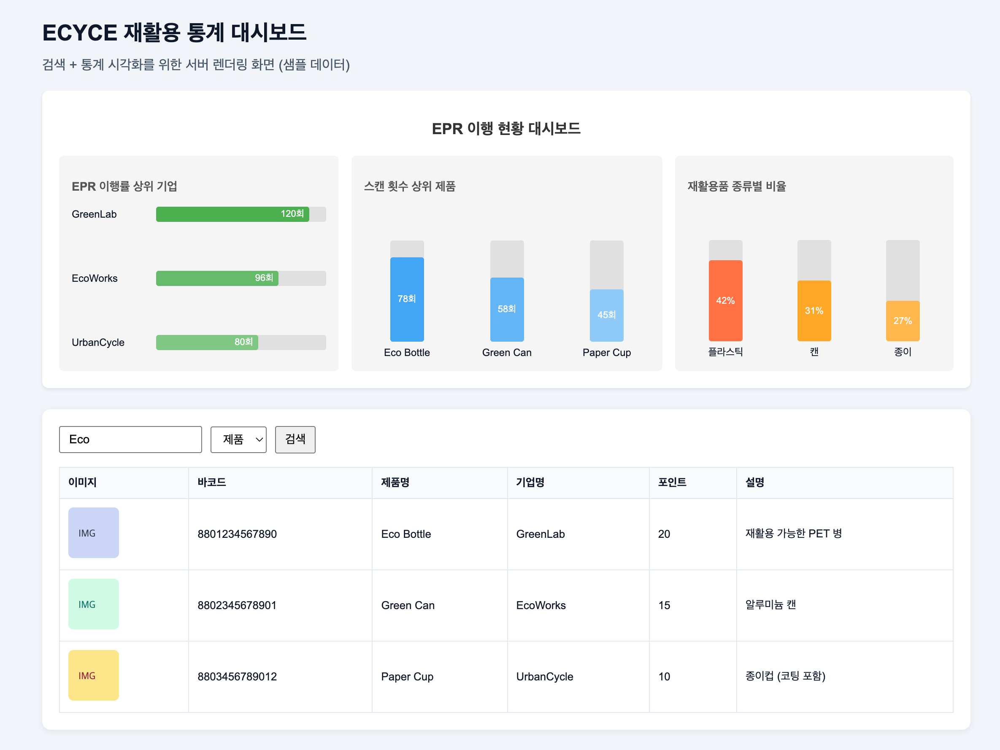

# ECYCE

재활용품 데이터를 기반으로 검색·통계·리워드 이력을 제공하는 NestJS 백엔드입니다. 바코드/제조사/카테고리 단위 조회와 대시보드(EJS) 렌더링을 지원합니다.

## 데모 화면



- 위 이미지는 샘플 데이터로 렌더링한 대시보드 캡쳐입니다.

## 주요 기능

- 바코드/제조사/카테고리 기반 재활용 데이터 조회
- 측정 데이터 검색 및 페이지네이션
- 대시보드 통계 지표 렌더링(EJS)
- 사용자, 리워드, 히스토리 관리 API
- 세션 기반 로그인(passport-local)

## 기술 스택

- NestJS, TypeScript
- PostgreSQL, TypeORM
- Passport, express-session
- EJS (views)

## API 요약

- `GET /measurement/barcode/:barcode`
- `GET /measurement/manufacturer/:manufacturer`
- `GET /measurement/manufacturer/:manufacturer/details`
- `GET /measurement/category`
- `GET /measurement/category/:category`
- `GET /measurement/search`
- `GET /measurement/recyclables`
- `GET /users`
- `GET /recyclables`
- `GET /history`
- `GET /rewards`

## 실행 방법

### Docker

```bash
# .env 파일에 환경 변수 입력
docker compose up --build
```

- 기본 포트는 `20221` 입니다.
- 컨테이너에 `./public/images`를 마운트합니다.
- `docker-compose.yml`은 `DB_NAME`을 사용합니다. 앱은 `DB_DATABASE`를 읽으므로 둘 다 설정하거나 compose 파일을 수정하세요.

### 로컬

```bash
npm install
npm run start:dev
```

- 기본 포트는 `20221` 입니다.
- 초기 데이터가 필요하면 `npm run seed`를 사용하세요.

## 환경 변수

- `PORT` (기본값: 20221)
- `DB_HOST`
- `DB_PORT`
- `DB_USERNAME`
- `DB_PASSWORD`
- `DB_DATABASE`
- `POSTGRES_USER`
- `POSTGRES_PASSWORD`
- `POSTGRES_DB`

## 프로젝트 구조

- `src/auth`: 로그인 및 세션 인증
- `src/users`: 사용자 API
- `src/recyclables`: 재활용품 API
- `src/history`: 활동 이력 API
- `src/rewards`: 리워드 API
- `src/measurement`: 검색/통계/대시보드
- `views`: EJS 템플릿
- `public`: 정적 파일
